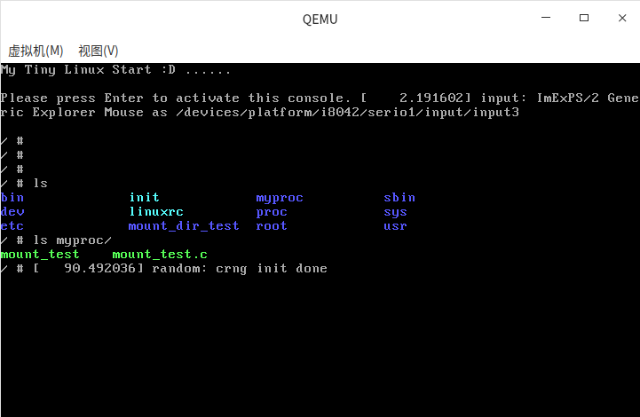

# Mount Namespace

### Mount Namespace说明

Mount Namespace是Linux最早支持的命名空间，支持在不同的Namespace中可以看到不同的挂载视图。玲珑沙箱通过Mount Namespace构建的沙箱rootfs视图如下：

```bash
uos@uos:/$ ls
bin  dev  etc  home  lib  lib32  lib64  libx32  ll-host  media  mnt  opt  persistent  proc  run  runtime  sys  tmp  usr  var
uos@uos:/$ tree -L 3 /opt
/opt
└── apps
    └── org.deepin.calculator
        ├── entries
        ├── files
        ├── info.json
        └── linglong.yaml

4 directories, 2 files
uos@uos:/$ tree -L 1 /runtime
/runtime
├── bin
├── lib
├── share
└── tests

4 directories, 0 files
uos@uos:/$ tree -L 1 /runtime/lib
/runtime/lib
├── binaries
├── cmake
├── libdouble-conversion.so -> libdouble-conversion.so.3.0.0
├── libdouble-conversion.so.1 -> libdouble-conversion.so.3.0.0
├── libdouble-conversion.so.3.0.0
└── x86_64-linux-gnu

2 directories, 4 files
```

构建沙箱的配置 $Pid.json如下，沙箱根据json文件中"namespaces"字段配置调用clone来创建Mount Namespace。

```json
{
    "annotations": {
        "containerRootPath": "/run/user/1000/linglong/6cc18d0369814f40842f3e22b474d6e8",
        "dbusProxyInfo": {
            "appID": "org.deepin.calculator",
            "busType": "session",
            "enable": true,
            "interface": [],
            "name": [],
            "path": [],
            "proxyPath": "/run/user/1000/.dbus-proxy/session-bus-proxy-EdrpiK"
        },
        "native": {
            "mounts": [
                {
                    "destination": "/usr",
                    "options": [
                        "ro",
                        "rbind"
                    ],
                    "source": "/usr",
                    "type": "bind"
                },
                {
                    "destination": "/etc",
                    "options": [
                        "ro",
                        "rbind"
                    ],
                    "source": "/etc",
                    "type": "bind"
                },
                {
                    "destination": "/runtime",
                    "options": [
                        "ro",
                        "rbind"
                    ],
                    "source": "/persistent/linglong/layers/org.deepin.Runtime/23.0.0.1/x86_64/files",
                    "type": "bind"
                },
                {
                    "destination": "/usr/share/locale/",
                    "options": [
                        "ro",
                        "rbind"
                    ],
                    "source": "/usr/share/locale/",
                    "type": "bind"
                },
                {
                    "destination": "/opt/apps/org.deepin.calculator",
                    "options": [
                        "rw",
                        "rbind"
                    ],
                    "source": "/persistent/linglong/layers/org.deepin.calculator/5.7.21.7/x86_64",
                    "type": "bind"
                }
            ]
        }
    },
    "hostname": "linglong",
    "linux": {
        "gidMappings": [
            {
                "containerID": 0,
                "hostID": 1000,
                "size": 1
            }
        ],
        "namespaces": [
            {
                "type": "pid"
            },
            {
                "type": "mount"
            },
            {
                "type": "uts"
            },
            {
                "type": "user"
            }
        ],
        "uidMappings": [
            {
                "containerID": 0,
                "hostID": 1000,
                "size": 1
            }
        ]
    },
    "mounts": [
        {
            "destination": "/sys",
            "options": [
                "nosuid",
                "noexec",
                "nodev"
            ],
            "source": "sysfs",
            "type": "sysfs"
        },
        {
            "destination": "/proc",
            "options": [],
            "source": "proc",
            "type": "proc"
        },
        {
            "destination": "/dev",
            "options": [
                "nosuid",
                "strictatime",
                "mode=0755",
                "size=65536k"
            ],
            "source": "tmpfs",
            "type": "tmpfs"
        },
        {
            "destination": "/dev/pts",
            "options": [
                "nosuid",
                "noexec",
                "newinstance",
                "ptmxmode=0666",
                "mode=0620"
            ],
            "source": "devpts",
            "type": "devpts"
        },
        {
            "destination": "/dev/shm",
            "options": [
                "nosuid",
                "noexec",
                "nodev",
                "mode=1777"
            ],
            "source": "shm",
            "type": "tmpfs"
        },
        {
            "destination": "/dev/mqueue",
            "options": [
                "nosuid",
                "noexec",
                "nodev"
            ],
            "source": "mqueue",
            "type": "mqueue"
        },
        {
            "destination": "/sys/fs/cgroup",
            "options": [
                "nosuid",
                "noexec",
                "nodev",
                "relatime",
                "ro"
            ],
            "source": "cgroup",
            "type": "cgroup"
        },
        {
            "destination": "/dev/dri",
            "options": [
                "rbind"
            ],
            "source": "/dev/dri",
            "type": "bind"
        },
        {
            "destination": "/dev/snd",
            "options": [
                "rbind"
            ],
            "source": "/dev/snd",
            "type": "bind"
        },
        {
            "destination": "/run/user/1000",
            "options": [
                "nodev",
                "nosuid",
                "mode=700"
            ],
            "source": "tmpfs",
            "type": "tmpfs"
        },
        {
            "destination": "/run/user/1000/pulse",
            "options": [
                "rbind"
            ],
            "source": "/run/user/1000/pulse",
            "type": "bind"
        },
        {
            "destination": "/run/user/1000/gvfs",
            "options": [
                "rbind"
            ],
            "source": "/run/user/1000/gvfs",
            "type": "bind"
        },
        {
            "destination": "/run/udev",
            "options": [
                "rbind"
            ],
            "source": "/run/udev",
            "type": "bind"
        },
        {
            "destination": "/dev/video0",
            "options": [
                "rbind"
            ],
            "source": "/dev/video0",
            "type": "bind"
        },
        {
            "destination": "/dev/video1",
            "options": [
                "rbind"
            ],
            "source": "/dev/video1",
            "type": "bind"
        },
        {
            "destination": "/run/user/1000/wayland-0",
            "options": [
                "rbind"
            ],
            "source": "/run/user/1000/wayland-0",
            "type": "bind"
        },
        {
            "destination": "/run/user/1000/wayland-0.lock",
            "options": [
                "rbind"
            ],
            "source": "/run/user/1000/wayland-0.lock",
            "type": "bind"
        },
        {
            "destination": "/home/uos",
            "options": [
                "rbind"
            ],
            "source": "/home/uos",
            "type": "bind"
        },
        {
            "destination": "/persistent/home/uos",
            "options": [
                "rbind"
            ],
            "source": "/persistent/home/uos",
            "type": "bind"
        },
        {
            "destination": "/home/uos/.linglong/org.deepin.calculator",
            "options": [
                "rbind"
            ],
            "source": "/home/uos/.linglong/org.deepin.calculator",
            "type": "bind"
        },
        {
            "destination": "/home/uos/.local/share",
            "options": [
                "rbind"
            ],
            "source": "/home/uos/.linglong/org.deepin.calculator/share",
            "type": "bind"
        },
        {
            "destination": "/home/uos/.config",
            "options": [
                "rbind"
            ],
            "source": "/home/uos/.linglong/org.deepin.calculator/config",
            "type": "bind"
        },
        {
            "destination": "/home/uos/.cache",
            "options": [
                "rbind"
            ],
            "source": "/home/uos/.linglong/org.deepin.calculator/cache",
            "type": "bind"
        },
        {
            "destination": "/home/uos/.deepinwine",
            "options": [
                "rbind"
            ],
            "source": "/home/uos/.deepinwine",
            "type": "bind"
        },
        {
            "destination": "/run/user/1000/dconf",
            "options": [
                "rbind"
            ],
            "source": "/run/user/1000/dconf",
            "type": "bind"
        },
        {
            "destination": "/home/uos/.linglong/org.deepin.calculator/config/systemd/user",
            "options": [
                "rbind"
            ],
            "source": "/home/uos/.config/systemd/user",
            "type": "bind"
        },
        {
            "destination": "/home/uos/.config/user-dirs.dirs",
            "options": [
                "rbind"
            ],
            "source": "/home/uos/.config/user-dirs.dirs",
            "type": "bind"
        },
        {
            "destination": "/home/uos/.linglong/org.deepin.calculator/config/user-dirs.dirs",
            "options": [
                "rbind"
            ],
            "source": "/home/uos/.config/user-dirs.dirs",
            "type": "bind"
        },
        {
            "destination": "/home/uos/.linglong/org.deepin.calculator/share/fonts",
            "options": [
                "ro",
                "rbind"
            ],
            "source": "/home/uos/.local/share/fonts",
            "type": "bind"
        },
        {
            "destination": "/home/uos/.linglong/org.deepin.calculator/config/fontconfig",
            "options": [
                "ro",
                "rbind"
            ],
            "source": "/home/uos/.config/fontconfig",
            "type": "bind"
        },
        {
            "destination": "/run/host/appearance/user-fonts",
            "options": [
                "ro",
                "rbind"
            ],
            "source": "/home/uos/.local/share/fonts",
            "type": "bind"
        },
        {
            "destination": "/run/host/appearance/user-fonts-cache",
            "options": [
                "ro",
                "rbind"
            ],
            "source": "/home/uos/.cache/fontconfig",
            "type": "bind"
        },
        {
            "destination": "/home/uos/.cache/deepin/dde-api",
            "options": [
                "ro",
                "rbind"
            ],
            "source": "/home/uos/.cache/deepin/dde-api",
            "type": "bind"
        },
        {
            "destination": "/home/uos/.linglong/org.deepin.calculator/cache/deepin/dde-api",
            "options": [
                "ro",
                "rbind"
            ],
            "source": "/home/uos/.cache/deepin/dde-api",
            "type": "bind"
        },
        {
            "destination": "/home/uos/.linglong/org.deepin.calculator/config/dconf",
            "options": [
                "ro",
                "rbind"
            ],
            "source": "/home/uos/.config/dconf",
            "type": "bind"
        },
        {
            "destination": "/home/uos/.Xauthority",
            "options": [
                "ro",
                "rbind"
            ],
            "source": "/home/uos/.Xauthority",
            "type": "bind"
        },
        {
            "destination": "/tmp",
            "options": [
                "rbind"
            ],
            "source": "/tmp/linglong/6cc18d0369814f40842f3e22b474d6e8",
            "type": "bind"
        },
        {
            "destination": "/run/host/network/etc/resolv.conf",
            "options": [
                "ro",
                "rbind"
            ],
            "source": "/etc/resolv.conf",
            "type": "bind"
        },
        {
            "destination": "/run/resolvconf",
            "options": [
                "ro",
                "rbind"
            ],
            "source": "/run/resolvconf",
            "type": "bind"
        },
        {
            "destination": "/run/host/appearance/fonts",
            "options": [
                "ro",
                "rbind"
            ],
            "source": "/usr/share/fonts",
            "type": "bind"
        },
        {
            "destination": "/usr/lib/locale/",
            "options": [
                "ro",
                "rbind"
            ],
            "source": "/usr/lib/locale/",
            "type": "bind"
        },
        {
            "destination": "/usr/share/themes",
            "options": [
                "ro",
                "rbind"
            ],
            "source": "/usr/share/themes",
            "type": "bind"
        },
        {
            "destination": "/usr/share/icons",
            "options": [
                "ro",
                "rbind"
            ],
            "source": "/usr/share/icons",
            "type": "bind"
        },
        {
            "destination": "/usr/share/zoneinfo",
            "options": [
                "ro",
                "rbind"
            ],
            "source": "/usr/share/zoneinfo",
            "type": "bind"
        },
        {
            "destination": "/run/host/etc/localtime",
            "options": [
                "ro",
                "rbind"
            ],
            "source": "/etc/localtime",
            "type": "bind"
        },
        {
            "destination": "/run/host/etc/machine-id",
            "options": [
                "ro",
                "rbind"
            ],
            "source": "/etc/machine-id",
            "type": "bind"
        },
        {
            "destination": "/etc/machine-id",
            "options": [
                "ro",
                "rbind"
            ],
            "source": "/etc/machine-id",
            "type": "bind"
        },
        {
            "destination": "/var",
            "options": [
                "ro",
                "rbind"
            ],
            "source": "/var",
            "type": "bind"
        },
        {
            "destination": "/run/host/appearance/fonts-cache",
            "options": [
                "ro",
                "rbind"
            ],
            "source": "/var/cache/fontconfig",
            "type": "bind"
        },
        {
            "destination": "/tmp/.X11-unix",
            "options": [
                "rbind"
            ],
            "source": "/tmp/.X11-unix",
            "type": "bind"
        },
        {
            "destination": "/media",
            "options": [
                "rw",
                "rbind"
            ],
            "source": "/media",
            "type": "bind"
        },
        {
            "destination": "/mnt",
            "options": [
                "rw",
                "rbind"
            ],
            "source": "/mnt",
            "type": "bind"
        },
        {
            "destination": "/usr/bin/xdg-open",
            "options": [
                "rbind"
            ],
            "source": "/persistent/linglong/layers/org.deepin.Runtime/23.0.0.1/x86_64/files/bin/xdg-open",
            "type": "bind"
        },
        {
            "destination": "/usr/bin/xdg-email",
            "options": [
                "rbind"
            ],
            "source": "/persistent/linglong/layers/org.deepin.Runtime/23.0.0.1/x86_64/files/bin/xdg-email",
            "type": "bind"
        },
        {
            "destination": "/tmp/screen-recorder",
            "options": [
                "rbind"
            ],
            "source": "/tmp/screen-recorder",
            "type": "bind"
        },
        {
            "destination": "/tmp/deepin-mail-web",
            "options": [
                "rbind"
            ],
            "source": "/tmp/deepin-mail-web",
            "type": "bind"
        },
        {
            "destination": "/run/app/env",
            "options": [
                "rbind"
            ],
            "source": "/run/user/1000/linglong/6cc18d0369814f40842f3e22b474d6e8/env",
            "type": "bind"
        },
        {
            "destination": "/run/user/1000//bus",
            "options": [],
            "source": "/run/user/1000/.dbus-proxy/session-bus-proxy-EdrpiK",
            "type": "bind"
        },
        {
            "destination": "/run/dbus/system_bus_socket",
            "options": [],
            "source": "/run/dbus/system_bus_socket",
            "type": "bind"
        }
    ],
    "ociVersion": "1.0.1",
    "process": {
        "args": [
            "deepin-calculator"
        ],
        "cwd": "/home/uos",
        "env": [
            "TERM=xterm",
            "_=/usr/bin/env",
            "PS1=️\\033[48;5;214;38;5;26m${debian_chroot:+($debian_chroot)}\\h ⚛ \\w\\033[0m",
            "QT_PLUGIN_PATH=/opt/apps/org.deepin.calculator/files/plugins:/runtime/lib/x86_64-linux-gnu/qt5/plugins:/usr/lib/x86_64-linux-gnu/qt5/plugins",
            "QT_QPA_PLATFORM_PLUGIN_PATH=/opt/apps/org.deepin.calculator/files/plugins/platforms:/runtime/lib/x86_64-linux-gnu/qt5/plugins/platforms:/usr/lib/x86_64-linux-gnu/qt5/plugins/platforms",
            "GST_PLUGIN_PATH=/opt/apps/org.deepin.calculator/files/lib/x86_64-linux-gnu/gstreamer-1.0",
            "LD_LIBRARY_PATH=/opt/apps/org.deepin.calculator/files/lib:/opt/apps/org.deepin.calculator/files/lib/x86_64-linux-gnu:/runtime/lib:/runtime/lib/x86_64-linux-gnu:/runtime/lib/i386-linux-gnu:/usr/lib:/usr/lib/x86_64-linux-gnu",
            "CLUTTER_IM_MODULE=xim",
            "DEEPIN_WINE_SCALE=1.25",
            "DESKTOP_SESSION=deepin",
            "DISPLAY=:0",
            "D_DISABLE_RT_SCREEN_SCALE=1",
            "GDMSESSION=deepin",
            "GIO_LAUNCHED_DESKTOP_FILE=/usr/share/applications/deepin-terminal.desktop",
            "GTK_IM_MODULE=fcitx",
            "HOME=/home/uos",
            "LANG=zh_CN.UTF-8",
            "LANGUAGE=zh_CN",
            "LINGLONG_ROOT=/persistent/linglong",
            "QT_IM_MODULE=fcitx",
            "QT_QPA_PLATFORM=",
            "USER=uos",
            "WAYLAND_DISPLAY=",
            "XAUTHORITY=/home/uos/.Xauthority",
            "XDG_CURRENT_DESKTOP=Deepin",
            "XDG_SESSION_DESKTOP=deepin",
            "XDG_SESSION_TYPE=x11",
            "XMODIFIERS=@im=fcitx",
            "PATH=/opt/apps/org.deepin.calculator/files/bin:/runtime/bin:/usr/local/bin:/usr/bin:/bin:/usr/local/games:/usr/games:/sbin:/usr/sbin",
            "XDG_RUNTIME_DIR=/run/user/1000",
            "DBUS_SESSION_BUS_ADDRESS=unix:path=/run/user/1000/bus",
            "XDG_DATA_DIRS=/opt/apps/org.deepin.calculator/files/share:/runtime/share:/persistent/linglong/entries/share:/home/uos/.local/share/linglong/entries/share:/usr/local/share:/usr/share",
            "XDG_CONFIG_HOME=/home/uos/.linglong/org.deepin.calculator/config",
            "XDG_CACHE_HOME=/home/uos/.linglong/org.deepin.calculator/cache",
            "XDG_DATA_HOME=/home/uos/.linglong/org.deepin.calculator/share"
        ]
    },
    "root": {
        "path": "/run/user/1000/linglong/6cc18d0369814f40842f3e22b474d6e8/root",
        "readonly": false
    }
}
```

clone：创建一个新的进程并把他放到新的namespace中

```c
int clone(int (*child_func)(void *), void *child_stack
            , int flags, void *arg);
flags: 
    指定一个或者多个上面的CLONE_NEW*（当然也可以包含跟namespace无关的flags）， 
    这样就会创建一个或多个新的不同类型的namespace， 
    并把新创建的子进程加入新创建的这些namespace中。
```

setns：将当前进程加入到已有的namespace中

```c
int setns(int fd, int nstype);
    
fd:
    指向/proc/[pid]/ns/目录里相应namespace对应的文件，
    表示要加入哪个namespace
nstype:
    指定namespace的类型（上面的任意一个CLONE_NEW*）:

    1. 如果当前进程不能根据fd得到它的类型，如fd由其他进程创建，
       并通过UNIX domain socket传给当前进程，那么就需要通过nstype来指定fd指向的namespace的类型
    2. 如果进程能根据fd得到namespace类型，比如这个fd是由当前进程打开的，那么nstype设置为0即可
```

clone和unshare的区别

clone和unshare的功能都是创建并加入新的namespace，它们的区别是：

- unshare是使当前进程加入新的namespace
- clone是创建一个新的子进程，然后让子进程加入新的namespace，而当前进程保持不变

### 实验验证

在终端中测试mount namespace 结果如下：

```bash
root@uos:/home/uos/Desktop# unshare -m
root@uos:/home/uos/Desktop# mount --bind /home/uos/Desktop/mount_test /mnt
root@uos:/home/uos/Desktop# ls -l /mnt
总用量 4
-rw-r--r--. 1 uos uos 15 11月 23 13:24 test.txt
root@uos:/home/uos/Desktop# cat /mnt/test.txt 
this is a test
root@uos:/home/uos/Desktop# stat /mnt/test.txt
  文件：/mnt/test.txt
  大小：15              块：8          IO 块：4096   普通文件
设备：fe07h/65031d      Inode：1453599     硬链接：1
权限：(0644/-rw-r--r--)  Uid：( 1000/     uos)   Gid：( 1000/     uos)
环境：user_u:object_r:user_home_t:s0
最近访问：2022-11-23 13:24:42.354796048 +0800
最近更改：2022-11-23 13:24:38.162778400 +0800
最近改动：2022-11-23 13:24:38.162778400 +0800
创建时间：-
root@uos:/home/uos/Desktop# exit
注销
root@uos:/home/uos/Desktop# cat /mnt/test.txt
cat: /mnt/test.txt: 没有那个文件或目录

root@uos:/home/uos/Desktop# stat /home/uos/Desktop/mount_test/test.txt 
  文件：/home/uos/Desktop/mount_test/test.txt
  大小：15              块：8          IO 块：4096   普通文件
设备：fe07h/65031d      Inode：1453599     硬链接：1
权限：(0644/-rw-r--r--)  Uid：( 1000/     uos)   Gid：( 1000/     uos)
环境：user_u:object_r:user_home_t:s0
最近访问：2022-11-23 13:24:42.354796048 +0800
最近更改：2022-11-23 13:24:38.162778400 +0800
最近改动：2022-11-23 13:24:38.162778400 +0800
创建时间：-
root@uos:/home/uos/Desktop#
# 在宿主机无法查看命名空间挂载视图
uos@uos:~/Desktop/mount_test$ ls -l /mnt
总用量 4
drwxr-xr-x. 2 root root 4096 3月  24  2022 rootb
uos@uos:~/Desktop/mount_test$ 

```

 Mount Namespace还有一个特殊的地方就是挂载传播（mount propagation），挂载传播是指由一个挂载对象的状态变化导致的其它挂载对象的挂载与解除挂载动作的事件。针对容器这个场景就是，如果Docker内执行了一次挂载后，宿主机上是否能看到这个挂载，反过来，如果宿主机执行了某个挂载，容器内是否能看见。常见的有三种挂载方式：

共享关系（share relationship），如果两个挂载对象具有共享关系，那么一个挂载对象中的挂载事件会传播到另一个挂载对象，反之亦然。也就是说容器和宿主机的挂载会互相可见。

从属关系（slave relationship），如果两个挂载对象形成从属关系，那么一个挂载对象中的挂载事件会传播到另一个挂载对象，但是反过来不行；在这种关系中，从属对象是事件的接收者。也就是说主机挂载容器可见，反过来不行。

私有关系（private relationship），之间互相不传播，相互独立。也就是说相互不可见。

### 内核流程追踪

#### 1.测试源码mount_test.c

```c
#define _GNU_SOURCE
#include <errno.h>
#include <sys/types.h>
#include <sys/wait.h>
#include <stdio.h>
#include <sched.h>
#include <signal.h>
#include <unistd.h>

#define STACK_SIZE (1024 * 1024)
static char container_stack[STACK_SIZE];

char* const container_args[] = {
    "/bin/bash",
    NULL
};

int container_main(void* arg)
{
    printf("Container[%5d] - inside the container!\n", getpid());
    sethostname("container",10); 
    /* 重新mount proc文件系统到 /proc下 否则沙箱内无法执行bash和ps命令*/
    system("mount -t proc proc /proc");
    /*mount进去后 沙箱mnt目录下可以读取mount_dir中的文件，但不影响宿主机上/mnt目录的文件视图*/
    // system("mount --bind /home/uos/Desktop/mount_dir /mnt");
    int ret = execv(container_args[0], container_args);
    if (ret) {
        printf("execv cmd ret:%d info:%s\n", ret, strerror(errno));
    }
    return 1;
}

int main()
{
    printf("Parent[%5d] - start a container!\n", getpid());
    int container_pid = clone(container_main, container_stack+STACK_SIZE, 
                              SIGCHLD | CLONE_NEWUTS | CLONE_NEWIPC | CLONE_NEWPID | CLONE_NEWNS
                              , NULL);
    waitpid(container_pid, NULL, 0);
    printf("Parent - container stopped!\n");
    return 0;
}
```

#### 2.测试过程

gcc ./mount_test.c -o mount_test

```bash
# 需要切换root来执行mount_test
root@uos:/home/uos/Desktop# ./mount_test 
Parent[ 1857] - start a container!
Container[    1] - inside the container!
root@container:/home/uos/Desktop# ps -ef
UID        PID  PPID  C STIME TTY          TIME CMD
root         1     0  0 15:11 pts/2    00:00:00 /bin/bash
root        13     1  0 15:11 pts/2    00:00:00 ps -ef
root@container:/home/uos/Desktop# exit
exit
Parent - container stopped!
root@uos:/home/uos/Desktop#
```

在通过CLONE_NEWNS创建mount namespace后，父进程会把自己的文件结构复制给子进程中。**而子进程中新的namespace中的所有mount操作都只影响自身的文件系统而不对外界产生任何影响**。这样可以做到比较严格地隔离。

#### 3.内核实现原理分析

#### 1.准备内核调试环境

* [QEMU + BusyBox调试LINUX内核环境搭建
](http://kerneltravel.net/blog/2021/debug_kernel_szp/)

本文基于linux-4.19.256 + busybox-1.35.0版本进行调试追踪。调试内核时，通常需要执行某个命令或启动一个进程或加载一个ko来触发内核相关函数运行的需求，这个可以通过将直接编译好的elf文件、ko放到busybox-1.35.0/_install目录。我们先准备一个应用程序，将应用程序加到busybox构建的rootfs 调试环境中。有两种方式，一种是将应用程序源码添加到busybox做成busybox的内置命令；另一种是直接将**静态编译**好的二进制文件预置到busybox中，本方案选择后面一种。

#### 2.调试过程

```bash
gcc mount_test.c -o mount_test -static
```
* [busybox建立最小文件系统
](https://blog.csdn.net/jasonLee_lijiaqi/article/details/80967912)

将静态编译好的二进制文件直接放到busybox  _install目录中或者直接在 _install目录中自定义一个文件夹静态编译。

```bash
# mount_dir_test是为了挂载测试手动创建的目录，myproc放的是测试挂载的源码
uos@uos:/media/linux-4.19.256/busybox-1.35.0/_install$ ls
bin  linuxrc  mount_dir_test  myproc  sbin  usr
uos@uos:/media/linux-4.19.256/busybox-1.35.0/_install/myproc$ ls
mount_test  mount_test.c
```

```bash
uos@uos:/media/linux-4.19.256$ ls
busybox-1.35.0  busybox-1.35.0.tar.bz2  initramfs.img  libTest  linux-4.19.256
uos@uos:/media/linux-4.19.256$ mkdir ramdisk
uos@uos:/media/linux-4.19.256$ cd ramdisk
uos@uos:/media/linux-4.19.256/ramdisk$ cp -r ../busybox-1.35.0/_install/*  .
uos@uos:/media/linux-4.19.256/ramdisk$ ln -s bin/busybox init
uos@uos:/media/linux-4.19.256/ramdisk$ ls
bin  init  linuxrc  myproc  sbin  usr
uos@uos:/media/linux-4.19.256/ramdisk$ mkdir -pv {bin,sbin,etc,proc,sys,usr/{bin,sbin},dev}
mkdir: 已创建目录 'etc'
mkdir: 已创建目录 'proc'
mkdir: 已创建目录 'sys'
mkdir: 已创建目录 'dev'
uos@uos:/media/linux-4.19.256/ramdisk$ cd etc
uos@uos:/media/linux-4.19.256/ramdisk/etc$ vim inittab

inittab文件的内容如下所示:
::sysinit:/etc/init.d/rcS   
::askfirst:-/bin/sh    
::restart:/sbin/init
::ctrlaltdel:/sbin/reboot
::shutdown:/bin/umount -a -r
::shutdown:/sbin/swapoff -a

uos@uos:/media/linux-4.19.256/ramdisk/etc$ chmod +x inittab
uos@uos:/media/linux-4.19.256/ramdisk/etc$ mkdir init.d
uos@uos:/media/linux-4.19.256/ramdisk/etc$ cd init.d
uos@uos:/media/linux-4.19.256/ramdisk/etc/init.d$ vim rcS

rcS文件的内容如下所示：
#!/bin/sh

mount proc
mount -o remount,rw /
mount -a    
clear                               
echo "My Tiny Linux Start :D ......"

uos@uos:/media/linux-4.19.256/ramdisk/etc/init.d$ chmod +x rcS
uos@uos:/media/linux-4.19.256/ramdisk/etc/init.d$ ls
rcS
uos@uos:/media/linux-4.19.256/ramdisk/etc/init.d$ cd ../../
uos@uos:/media/linux-4.19.256/ramdisk$ ls
bin  dev  etc  init  linuxrc  myproc  proc  sbin  sys  usr
uos@uos:/media/linux-4.19.256/ramdisk$ cd ..
uos@uos:/media/linux-4.19.256$ ls
busybox-1.35.0  busybox-1.35.0.tar.bz2  initramfs.img  libTest  linux-4.19.256  ramdisk
uos@uos:/media/linux-4.19.256$ cd ramdisk/etc/
uos@uos:/media/linux-4.19.256/ramdisk/etc$ vim fstab

fstab文件的内容如下所示:
# /etc/fstab

proc            /proc        proc    defaults          0       0

sysfs           /sys         sysfs   defaults          0       0

devtmpfs        /dev         devtmpfs  defaults          0       0

uos@uos:/media/linux-4.19.256/ramdisk/etc$ ls
fstab  init.d  inittab
uos@uos:/media/linux-4.19.256/ramdisk/etc$ cd ..
uos@uos:/media/linux-4.19.256/ramdisk$ ls
bin  dev  etc  init  linuxrc  myproc  proc  sbin  sys  usr
uos@uos:/media/linux-4.19.256/ramdisk$ find . -print0 | cpio --null -ov --format=newc | gzip -9 > ../initramfs.img
```

```bash
uos@uos:/media/linux-4.19.256$ ls
busybox-1.35.0  busybox-1.35.0.tar.bz2  initramfs.img  libTest  linux-4.19.256  ramdisk
uos@uos:/media/linux-4.19.256$ qemu-system-x86_64 -kernel ./linux-4.19.256/arch/x86_64/boot/bzImage -initrd initramfs.img -smp 2  -S -s -m 2048   
```

 qemu-system-x86_64的参数比较多： 　

-kernel 是指定一个大内核文件，当仁不让的是bzImage　

-initrd 是指定一个 initrd.img文件，这个文件就是我们使用busybox生成的initramfs.img 　

-smp 可以从名字猜想，它是给qemu指定几个处理器，或者是几个线程　

-gdb则是启动qemu的内嵌gdbserver，监听的是本地tcp端口1234—如果这样写： -gdb tcp:192.168.1.100:1234 ，似乎也是没问题的　

-S 就是挂起gdbserver，让gdb remote connect it 　

-s 默认使用1234端口进行远程调试，和-gdb tcp::1234类似 　

-m 2048 指定内存大小为2048M           

执行命令后，需要在终端新开一个窗口

```bash
uos@uos:/media/linux-4.19.256$ ls
busybox-1.35.0  busybox-1.35.0.tar.bz2  initramfs.img  libTest  linux-4.19.256  ramdisk
uos@uos:/media/linux-4.19.256$ gdb linux-4.19.256/vmlinux
GNU gdb (Uos 8.2.1.1-1+security) 8.2.1
Copyright (C) 2018 Free Software Foundation, Inc.
License GPLv3+: GNU GPL version 3 or later <http://gnu.org/licenses/gpl.html>
This is free software: you are free to change and redistribute it.
There is NO WARRANTY, to the extent permitted by law.
Type "show copying" and "show warranty" for details.
This GDB was configured as "x86_64-linux-gnu".
Type "show configuration" for configuration details.
For bug reporting instructions, please see:
<http://www.gnu.org/software/gdb/bugs/>.
Find the GDB manual and other documentation resources online at:
    <http://www.gnu.org/software/gdb/documentation/>.

For help, type "help".
Type "apropos word" to search for commands related to "word"...
Reading symbols from linux-4.19.256/vmlinux...done.
warning: File "/media/uthuqinghong/EEECE1A7ECE169F3/linux-4.19.256/linux-4.19.256/scripts/gdb/vmlinux-gdb.py" auto-loading has been declined by your `auto-load safe-path' set to "$debugdir:$datadir/auto-load".
To enable execution of this file add
        add-auto-load-safe-path /media/uthuqinghong/EEECE1A7ECE169F3/linux-4.19.256/linux-4.19.256/scripts/gdb/vmlinux-gdb.py
line to your configuration file "/home/uthuqinghong/.gdbinit".
To completely disable this security protection add
        set auto-load safe-path /
line to your configuration file "/home/uthuqinghong/.gdbinit".
For more information about this security protection see the
"Auto-loading safe path" section in the GDB manual.  E.g., run from the shell:
        info "(gdb)Auto-loading safe path"
(gdb) target remote:1234
Remote debugging using :1234
0x000000000000fff0 in exception_stacks ()
(gdb) c
Continuing.
# 断点情况如下
(gdb) i b
Num     Type           Disp Enb Address            What
1       breakpoint     keep y   0xffffffff811ca8e0 in do_mount at fs/namespace.c:2748
2       breakpoint     keep y   0xffffffff811c89e0 in commit_tree at fs/namespace.c:898
3       breakpoint     keep y   0xffffffff811ca4f0 in do_add_mount at fs/namespace.c:2439
4       breakpoint     keep y   0xffffffff811c9620 in mnt_set_mountpoint at fs/namespace.c:836
5       breakpoint     keep y   0xffffffff811ca9e7 in do_new_mount at ./arch/x86/include/asm/current.h:15
```

调试开始后，QEMU界面如下图：




执行/myproc/mount_test后，部分调用堆栈如下：

```bash
(gdb) bt
#0  mnt_set_mountpoint (mnt=0xffff88807ccb0780, mp=0xffff88807c24e680, child_mnt=0xffff88807ccb0900) at fs/namespace.c:836
#1  0xffffffff811c9e80 in attach_mnt (mp=<optimized out>, parent=<optimized out>, mnt=<optimized out>) at fs/namespace.c:1771
#2  copy_tree (mnt=<optimized out>, dentry=<optimized out>, flag=5) at fs/namespace.c:1771
#3  0xffffffff811cb61a in copy_mnt_ns (flags=<optimized out>, ns=0xffff88807d439180, user_ns=0xffffffff82440a80 <init_user_ns>, 
    new_fs=0xffff88807ca037c0) at fs/namespace.c:2923
#4  0xffffffff81079d83 in create_new_namespaces (flags=738328593, tsk=0xffff88807cb1a580, user_ns=0xffffffff82440a80 <init_user_ns>, 
    new_fs=0xffff88807ca037c0) at kernel/nsproxy.c:75
#5  0xffffffff81079f47 in copy_namespaces (flags=738328593, tsk=0xffff88807cb1a580) at kernel/nsproxy.c:165
#6  0xffffffff81057537 in copy_process (clone_flags=738328593, stack_start=<optimized out>, stack_size=<optimized out>, 
    child_tidptr=<optimized out>, pid=<optimized out>, trace=<optimized out>, tls=<optimized out>, node=<optimized out>)
    at kernel/fork.c:1916
#7  0xffffffff810587ea in copy_process (pid=<optimized out>, node=<optimized out>, tls=<optimized out>, trace=<optimized out>, 
    child_tidptr=<optimized out>, stack_size=<optimized out>, stack_start=<optimized out>, clone_flags=<optimized out>)
    at kernel/fork.c:1719
#8  _do_fork (clone_flags=738328593, stack_start=<optimized out>, stack_size=<optimized out>, parent_tidptr=0x0 <irq_stack_union>, 
    child_tidptr=<optimized out>, tls=<optimized out>) at kernel/fork.c:2219
#9  0xffffffff810020f3 in do_syscall_64 (nr=<optimized out>, regs=0xffff88807c24e680) at arch/x86/entry/common.c:293
#10 0xffffffff81c00078 in entry_SYSCALL_64 () at arch/x86/entry/entry_64.S:238
#11 0x0000000000000000 in ?? ()
```

```bash
(gdb) bt
#0  mnt_set_mountpoint (mnt=0xffff88807c25e180, mp=0xffff88807c24ed00, child_mnt=0xffff88807c25ea80) at fs/namespace.c:836
#1  0xffffffff811ca3e7 in attach_recursive_mnt (source_mnt=0xffff88807c25ea80, dest_mnt=0xffff88807c25e180, 
    dest_mp=0xffff88807c24ed00, parent_path=0x0 <irq_stack_union>) at fs/namespace.c:2034
#2  0xffffffff811ca4c0 in graft_tree (mnt=<optimized out>, p=<optimized out>, mp=<optimized out>) at fs/namespace.c:2120
#3  0xffffffff811cb3da in do_loopback (recurse=<optimized out>, old_name=<optimized out>, path=<optimized out>)
    at fs/namespace.c:2228
#4  do_mount (dev_name=<optimized out>, dir_name=<optimized out>, type_page=<optimized out>, flags=<optimized out>, 
    data_page=<optimized out>) at fs/namespace.c:2819
#5  0xffffffff811cb8e1 in ksys_mount (dev_name=0xffff88807c22a128 "/myproc", dir_name=0x7ffe740f9f73 "/mount_dir_test", 
    type=0x0 <irq_stack_union>, flags=36864, data=<optimized out>) at fs/namespace.c:3041
#6  0xffffffff811cb91c in __do_sys_mount (data=<optimized out>, flags=<optimized out>, type=<optimized out>, 
    dir_name=<optimized out>, dev_name=<optimized out>) at fs/namespace.c:3055
#7  __se_sys_mount (data=<optimized out>, flags=<optimized out>, type=<optimized out>, dir_name=<optimized out>, 
    dev_name=<optimized out>) at fs/namespace.c:3052
#8  __x64_sys_mount (regs=<optimized out>) at fs/namespace.c:3052
#9  0xffffffff810020f3 in do_syscall_64 (nr=<optimized out>, regs=0xffff88807c24ed00) at arch/x86/entry/common.c:293
#10 0xffffffff81c00078 in entry_SYSCALL_64 () at arch/x86/entry/entry_64.S:238
#11 0x0000000000000000 in ?? ()
Backtrace stopped: Cannot access memory at address 0x8000

(gdb) p ((struct mountpoint *)0xffff88807c24ed00)->m_dentry->d_name
$2 = {{{hash = 1691441653, len = 14}, hash_len = 61820983797}, name = 0xffff88807c55f6f8 "mount_dir_test"}
(gdb) p ((struct mountpoint *)0xffff88807c24ed00)->m_dentry->d_name.name
$3 = (const unsigned char *) 0xffff88807c55f6f8 "mount_dir_test"
(gdb) p ((struct mount*)0xffff88807c25ea80)->mnt_mountpoint->d_name
$5 = {{{hash = 361005959, len = 6}, hash_len = 26130809735}, name = 0xffff88807c55f9f8 "myproc"}
```

在 Linux 进程中，是通过目录项 (dentry) 和索引节点 (inode) 描述文件的，而所谓 “文件” 就是按一定的格式存储在介质上的信息，所以一个文件其实包含了两方面的信息，一是存储的数据本身，二是有关该文件的组织和管理的信息。

在内存中, 每个文件都有一个 dentry 和 inode 结构，前者记录着文件名、上级目录等信息，所有的 dentry 用 d_parent 和 d_child连 接起来，就形成了我们熟悉的树状结构； 而有关该文件的组织和管理的信息主要存放 inode 里面，它记录着文件在存储介质上的位置与分布。

同时 dentry->d_inode 指向相应的 inode 结构，由于硬链接导致一个文件可能有好几个文件名，所以 dentry 与 inode 是多对一的关系。

inode 代表的是物理意义上的文件，通过 inode 可以得到一个数组，这个数组记录了文件内容的位置，如该文件位于硬盘的第 3、8、10 块，那么这个数组的内容就是 3、8、10。在同一个文件系统中可以通过索引节点号 inode->i_ino 计算出在介质上的位置，对于硬盘来说，可直接计算出对应的 inode 属于哪个块 (block)，从而找到相应的 inode 结构。

另外，对于某一种特定的文件系统而言，如 ext4，在内存中用 ext4_inode_info 结构体描述，包含了一个 inode 容器。就磁盘文件而言，dentry 和 inode 的信息保存在磁盘上，对于像 ext4 这样的磁盘文件来说，存储介质中的目录项和索引节点载体通过 ext4_inode、ext4_dir_entry_2 标示。

```
内核的整个Mount过程如下：
SYSCALL_DEFINE5(mount,...)
ksys_mount()
 |-do_mount()                           # 通过该函数调用已传入内核的参数
   |-user_path()                        # 把挂载点解析成path内核结构，也就是路径解析过程
   | |-user_path_at_empty()
   |   |-filename_lookup()
   |- ... ...                           # 解析flags确定mount的操作类型，如bind、remount、newmount
   |-do_remount()                       # 重新挂载等操作，下面以挂载新节点为例
   |-do_new_mount()
     |-get_fs_type()                    # 通过文件系统名称，找到对应文件系统的类型
     |-vfs_kern_mount()                 # 通过该函数调用具体文件系统的处理函数，构建一个vfsmnt结构
     | |-alloc_vfsmnt()                 # 分配新的struct mount结构体，并初始化其中的一部分，
     | |                                # 构造一个root dentry，包含特定文件系统的super block信息
     | |-mount_fs()                     # 调用具体文件系统的mount回调函数
     | |  |-type->mount()               # 调用特定文件系统的回调函数
     | |- ... ...                       # 完成最后struct mount的初始化
     |
     |-do_add_mount()                   # 将得到的mnt结构添加到全局文件系统
       |-lock_mount()                   # 找到最新的挂载点，并加锁
       |-real_mount()                   # 挂载到对应的mount点，对挂载进行检查
       |-graft_tree()                   # 将newmount添加到全局文件系统中
   |-do_loopback()
     |-graft_tree()
       |-attach_recursive_mnt()
         |-mnt_set_mountpoint()         # 建立挂载源目录与目标挂载点dentry之间的关联
         |-commit_tree()　　　　　　　　　 # 提交到全局散列表和文件系统中
```


Mount namespaces (CLONE_NEWNS, Linux2.4.19)　隔离一组进程的文件系统层次。在使用了新mountnamespace后，mount()和umount()就会在新的文件系统层次上操作，而不是在全局（默认）文件系统层次上。

每个mnt_namespace有自己独立的mount *root, 即根挂载点是互相独立的，同时由mount->mnt_child串接起来的子mnt链表，以及继续往下都是彼此独立的，产生的外在效果就是某个mnt_namespace中的mount、umount不会对其他namespace产生影响，因为整个mount树是每个namespace各有一份，彼此间无干扰，path lookup也在各自的mount树中进行。这里和chroot之类的操作不一样，chroot改变的只是task_struct相关的fs_struct中的root，影响的是path lookup的起始点，对整个mount树并无关系。不同的mnt_namespace可以引用不同的根文件系统，组织不同的文件系统挂载树，形成不同的目录结构。一般而言，新创建的进程总是与其父进程共用mnt_namespace。而所有进程都是1号进程(init)的子孙进程，则一般情况下所有进程都使用相同的mnt_namespace，都存在于相同的目录结构中。

但是在通过clone系统调用创建新进程时，可以指定CLONE_NEWNS标志，为子进程创建新的名字空间(其中就包含了mnt_namespace，此外名字空间还有其他内容)。

### 参考文档

* [Linux内核Namespace隔离测试
  ](https://blog.csdn.net/m0_73494896/article/details/126994706)

* [Linux Namespace和Cgroup
  ](https://segmentfault.com/a/1190000009732550)

* [Linux Mount Namespace
  ](https://www.toutiao.com/article/6983460627113345573/?&source=m_redirect)

* [文件系统mount过程
  ](https://blog.csdn.net/u012489236/article/details/124523247)

* [Linux VFS 文件系统
  ](https://gohalo.me/post/linux-kernel-virtual-file-system-introduce.html)

* [文件系统的隔离和共享
  ](https://waynerv.com/posts/container-fundamentals-filesystem-isolation-and-sharing/)

* [mnt namespace隔离文件原理
  ](https://blog.csdn.net/bme314/article/details/113056667)

* [基于qemu用户网络、debootstrap 调试内核
  ](https://github.com/realwujing/linux-learning/blob/main/debug/kernel/qemu/%E5%9F%BA%E4%BA%8Eqemu%E7%94%A8%E6%88%B7%E7%BD%91%E7%BB%9C%E3%80%81debootstrap%20%E8%B0%83%E8%AF%95%E5%86%85%E6%A0%B8%E3%80%81%E6%A0%B9%E6%96%87%E4%BB%B6%E7%B3%BB%E7%BB%9F.md)

* [Mnt_namespace分析
  ](https://codeantenna.com/a/J0Hct3RCXC)

busybox 中添加自定义applet

https://zhuanlan.zhihu.com/p/561923235

https://blog.csdn.net/weixin_42296411/article/details/120227869
